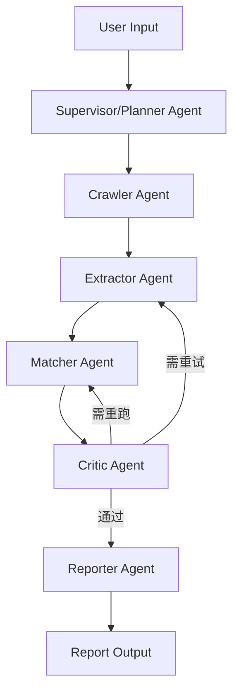

# Job Match Agent - Multi-Agent

- 自然语言输入招聘网址 + 求职偏好
- Supervisor 负责任务路由与重试
- Specialist Agents 负责抓取、提取、匹配、报告
- Critic Agent 负责结果质量审查与回流
- 输出 Markdown 推荐报告

## 1. 安装

```bash
cd job_match_agent
python -m venv .venv
source .venv/bin/activate   # Windows 用 .venv\Scripts\activate
pip install -r requirements.txt
cp .env.example .env
```

填写 `.env`：

```env
OPENAI_API_KEY=...
OPENAI_MODEL=gpt-4o-mini
# OPENAI_BASE_URL=...
```

## 2. 运行

### 方式 A：交互输入

```bash
python app.py
```

### 方式 B：命令行参数

```bash
python app.py --input-file sample_input.txt --max-jobs 12 --max-pages 3
```

## 3. 输出

运行后会生成：

- `outputs/user_profile.json`：结构化用户画像
- `outputs/crawled_jobs.json`：原始抓取结果
- `outputs/structured_jobs.json`：结构化岗位数据
- `outputs/match_results.json`：匹配评分结果
- `outputs/reports/latest_report.md`：最终推荐报告

## 4. Multi-Agent 架构



- Supervisor：基于状态决定下一节点。
- Specialists：只做单职责任务，复用 `tools/*` 业务能力。
- Critic：对提取完整度、评分一致性做质量门控。
- 当前实现是可扩展状态机，后续可迁移到 LangGraph / DAG。
