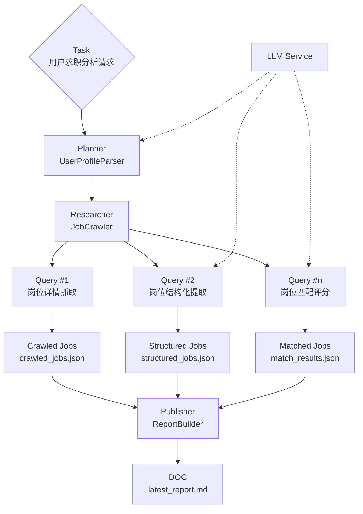

# Job Match Agent

- 自然语言输入招聘网址 + 求职偏好
- 自动抓取招聘网站列表页或详情页
- 提取岗位结构化信息
- 用 LLM 做岗位匹配评分
- 输出 Markdown 推荐报告

## 1. 安装

```bash
cd job_match_agent
python -m venv .venv
source .venv/bin/activate   # Windows 用 .venv\Scripts\activate
pip install -r requirements.txt
cp .env.example .env
```

填写 `.env`：

```env
OPENAI_API_KEY=...
OPENAI_MODEL=gpt-4o-mini
# OPENAI_BASE_URL=...
```

## 2. 运行

### 方式 A：交互输入

```bash
python app.py
```

示例输入：

```text
请帮我分析这个招聘网站里适合我的岗位：
https://jobxxxxx/index.htm

我的求职方向是XXX、XXX、AI算法、大模型；
希望工作地在上海、深圳、杭州、武汉；
学历是硕士/博士；
优先考虑高校、研究院或技术研发类岗位；
不考虑销售、行政和纯运维类岗位。
```

### 方式 B：命令行参数

```bash
python app.py --input-file sample_input.txt --max-jobs 12 --max-pages 3
```

## 3. 输出

运行后会生成：

- `outputs/crawled_jobs.json`：原始抓取结果
- `outputs/structured_jobs.json`：结构化岗位数据
- `outputs/match_results.json`：匹配评分结果
- `outputs/reports/latest_report.md`：最终推荐报告

## 4. 运行结构图

这个项目当前的运行方式是一个由 `app.py` 统一编排的串行流水线，而不是多 Agent 并发协作。整体结构如下：


如果希望用更接近 Agent 编排的视角去理解，这个项目目前可以抽象成下面这张“类 Agent 视图图”。注意这是一种职责映射，不代表当前代码已经实现了真正的多 Agent 自主协作：



这张图里各层的对应关系是：

1. Planner：把自然语言输入解析成用户画像和抓取约束。
2. Researcher：先抓页面，再逐条拿岗位内容做抽取和评分。
3. Publisher：把中间结果汇总成最终 Markdown 报告。

对应到实际执行步骤，就是：

1. 读取用户自然语言输入。
2. 用 LLM 解析出用户画像和招聘网址。
3. 按画像中的网址抓取列表页或详情页。
4. 对每个岗位正文做结构化提取。
5. 用用户画像和岗位信息做匹配评分。
6. 汇总成 Markdown 报告输出。
